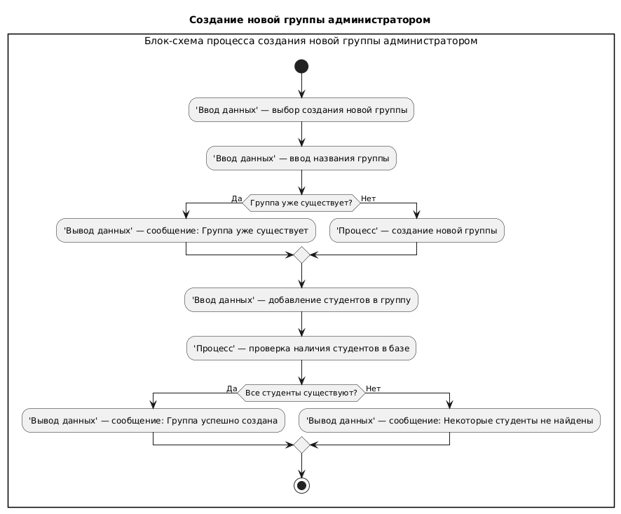

# Система учета посещаемости студентов

## Описание проекта
Система предназначена для автоматизации учета посещаемости студентов на учебных занятиях. Позволяет преподавателям отмечать посещаемость, администраторам управлять пользователями, а студентам просматривать свою статистику.

## Предметная область
В системе будут отображаться:
1. Список групп и студентов
2. Посещаемость каждого студента

## Цели системы
Система решает следующие задачи:
1. Автоматизация учета.
2. Контроль дисциплины. 

## Пользователи и функционал системы для каждой роли
- 👨‍🏫 Для преподавателей: 
  - Отметка посещаемости студентов
  - Просмотр расписания занятий

- 👨‍💼 Для администраторов:
  - Управление пользователями (создание, редактирование)
  - Настройка расписания
  - Формирование групп

- 👨‍🎓 Для студентов:
  - Просмотр личной статистики посещаемости
  
## Архитектура
1. Presentation Layer (Слой представления). 
Отвечает за ввод данных и отображение информации. Например, отметка посещаемости, просмотр посещаемости.
2.  Business Logic Layer (Слой бизнес логики).
Управляет основными процессами системы: регистрация посещаемости, проверка ролей.
3. Data layer (Слой данных)
Делиться на Data Access и Data base.
Data Access:
4. Уровень доступа к данным (выполнение запросов)  
5. Database:
База данных где хранятся таблицы студентов, групп, посещаемости и расписания.

## Технологии
- Python 3.x - язык программирования
- Git - система контроля версий
- GitHub - хостинг проекта
- Markdown - оформление документации
- PlantUML - создание диаграмм

## Блок схемы

## UseCase
